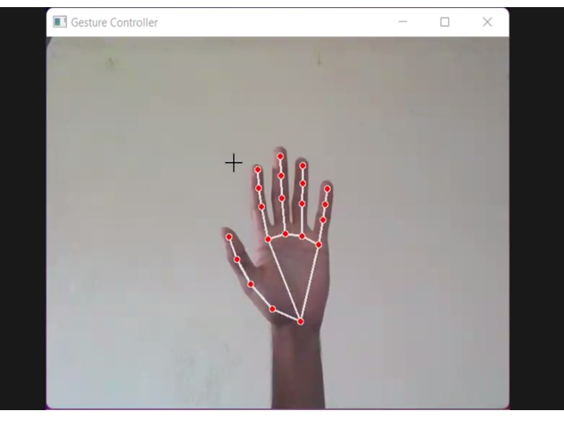
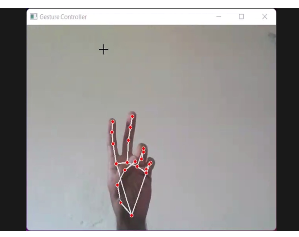
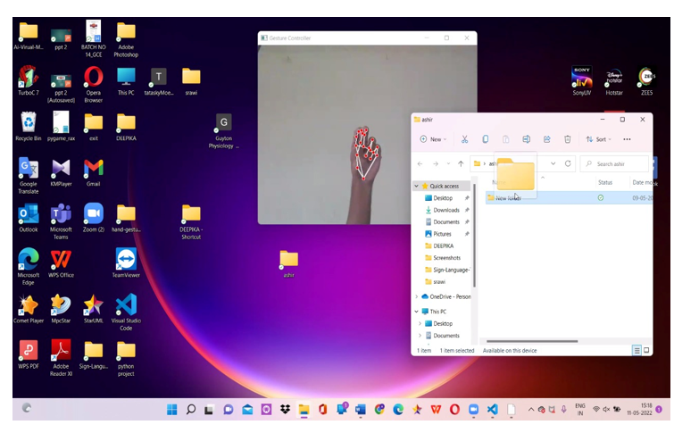

# Virtual Mouse using Hand Gesture Recognition

## 📌 Overview

This project enables users to control mouse functions using hand gestures detected via a webcam. It eliminates the need for a physical mouse and enhances human-computer interaction. The system performs real-time monitoring and analysis of hand gestures using computer vision techniques.

---

## 🚀 Features

* Cursor movement using hand gestures
* Left click, right click, double click
* Drag and drop functionality
* Volume and brightness control
* Real-time gesture detection

---

## 🛠️ Technologies Used

* Python
* OpenCV
* MediaPipe
* PyAutoGUI

---

## ⚙️ How It Works

* Captures real-time video using webcam
* Detects hand landmarks using MediaPipe
* Performs gesture recognition
* Maps gestures to mouse actions

---

## 📊 Key Functionalities

* Real-time monitoring and analysis of hand movements
* Gesture-based control for system operations
* Efficient tracking and interpretation of gestures
* Smooth and contactless human-computer interaction

---

## ▶️ Installation

```bash
pip install -r requirements.txt
```

---

## ▶️ Run the Project

```bash
python src/main.py
```

---

## 📂 Project Structure

```
virtual-mouse-gesture-control/
│── src/
│   └── main.py
│── demo/
│   ├── screenshot1.png
│   ├── screenshot2.png
│   ├── screenshot3.png
│── requirements.txt
│── README.md
```

---

## 📷 Demo

### Hand Detection



### Cursor Movement



### Gesture Control



---

## 🎯 Applications

* Touchless computer control systems
* Accessibility for physically challenged users
* Smart automation environments
* AI-based human-computer interaction

---

## 📈 Results

* Successfully controlled cursor using hand gestures
* Achieved smooth real-time tracking performance
* Reduced dependency on physical input devices

---

## 📌 Future Enhancements

* Multi-hand support
* Improved gesture accuracy
* Integration with IoT devices

---
